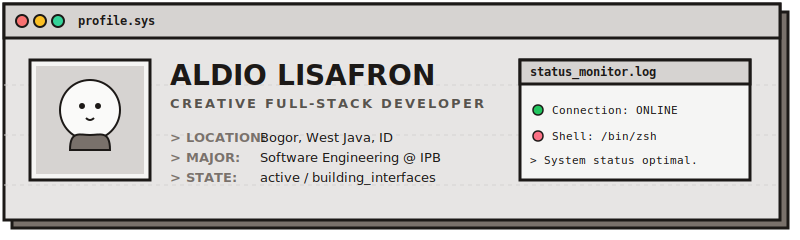
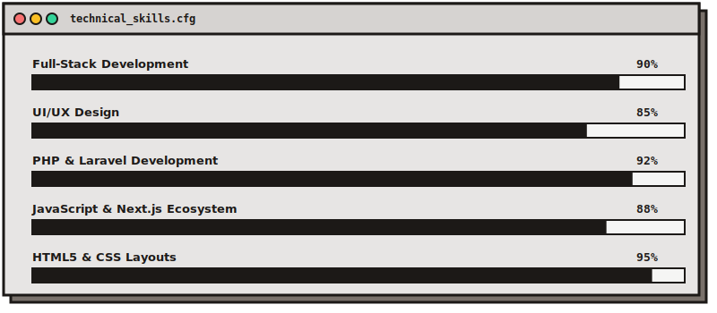
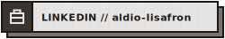
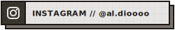
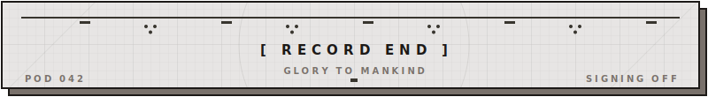

<!-- ════════════════════════════════════════════════════════════
     UNIT RECORD : al-dioooo
     FORMAT      : NieR graph-paper UI
     ════════════════════════════════════════════════════════════ -->

  

  <samp><b>Web developer focused on practical systems, calm interfaces, and maintainable code.</b></samp>

  

> <samp><b>POD 042:</b> Report — unit <code>al-dioooo</code> operating within normal parameters.
> Primary directive: turn everyday workflows into structured, usable tools.
> Proposal: review the records below.</samp>

## <samp>■ 01 · INTEL // unit_data</samp>

I build web applications that turn everyday workflows into structured, usable tools. My work usually sits around PHP/Laravel, JavaScript, database-backed features, and interface details that make apps easier to use.

I enjoy working on products with a clear real-world purpose: business systems, information dashboards, educational resources, content-driven websites, and tools that help people manage data with less friction.

  

## <samp>■ 02 · QUESTS // active_quests</samp>

| <samp>STATUS</samp> | <samp>QUEST LOG</samp> |
| :--- | :--- |
| <samp>▸ ACTIVE</samp> | Sharpening Laravel and PHP application structure |
| <samp>▸ ACTIVE</samp> | Improving frontend polish with cleaner responsive layouts |
| <samp>▸ ACTIVE</samp> | Writing clearer documentation for projects and technical decisions |
| <samp>▸ SIDE&nbsp;&nbsp;</samp> | Building small, focused tools before expanding the feature set |

  

## <samp>■ 03 · SYSTEM // operating_protocol</samp>

- <samp>P-01</samp> — Start from the user's workflow, then design the data and screens around it
- <samp>P-02</samp> — Prefer readable code, predictable structure, and small iterations
- <samp>P-03</samp> — Keep interfaces direct, calm, and easy to scan
- <samp>P-04</samp> — Document the "why" when a decision affects future changes

  

## <samp>■ 04 · INTEL // points_of_interest</samp>

- Practical web systems
- Local business process tools
- Cultural and educational web resources
- Clean dashboards, catalogs, and content management flows

  

## <samp>■ 05 · SKILLS // loadout</samp>

  

  

## <samp>■ 06 · COMMS // transmission_channels</samp>

  &nbsp;
  
   
  &nbsp;
  

  

<!-- [E]ject data? ... negative. Thanks for reading. -->
